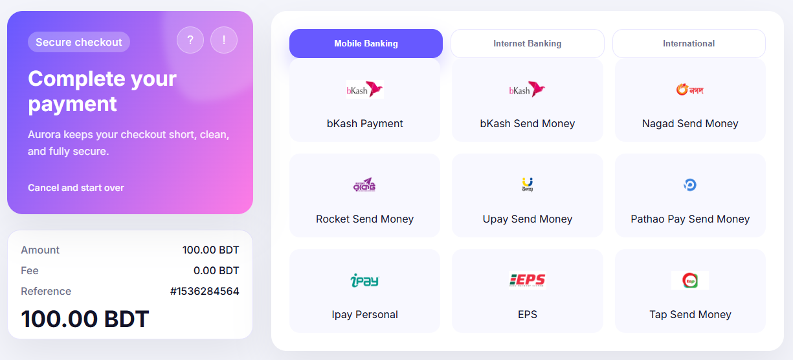
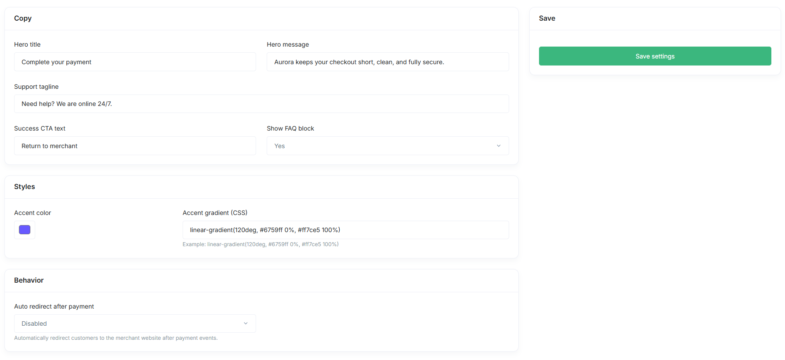

# Aurora Theme for PipraPay

Aurora Theme is a cohesive payment experience for PipraPay merchants by shipping both a checkout (gateway) theme and matching invoice/payment-link templates. The repository hosts everything you need to brand, configure, and deploy the theme through the PipraPay dashboard.

## Meta Data
- *Name*: Aurora
- *Version*: 1.0.0
- *License*: [GNU General Public License v3.0](LICENSE)
- *Author*: [Fattain Naime](https://iamnaime.info.bd)

## Features

### Screenshots

<div style="display:flex;gap:1rem;flex-wrap:wrap;align-items:flex-start;">
    <figure style="margin:0;flex:1 1 45%;max-width:500px;">
        
        <figcaption style="text-align:center;font-size:0.9rem;margin-top:0.25rem;">Aurora checkout screenshot</figcaption>
    </figure>
    <figure style="margin:0;flex:1 1 45%;max-width:500px;">
        
        <figcaption style="text-align:center;font-size:0.9rem;margin-top:0.25rem;">Aurora admin panel screenshot</figcaption>
    </figure>
</div>

### Gateway checkout
- Gradient hero, secure-status pill, and cancel CTA keep customers oriented during every transaction state.
- Card-based payment summary, support panel, and FAQ drawer pull data from global PipraPay settings so you only manage content once.
- Responsive gateway tabs group Mobile Banking, Internet Banking, and International methods, with sanitized method routing (`?method=`) that loads the correct plugin view.
- Shared status template renders initialize, pending, completed, failed, refunded, and fallback screens with optional auto-redirect timers and merchant return buttons.

### Invoice & payment links
- `aurora-invoice-class.php` renders invoices with computed subtotals, discounts, VAT, shipping, and status-aware pills backed by your dashboard data.
- `aurora-payment-link-class.php` mirrors the checkout visuals for standalone payment links, supports every custom field (including file inputs), and submits via `fetch` with inline progress states.
- Brand assets cascade from PipraPay -> Settings (logo, favicon, active tab colors) to keep hosted invoices and links on brand without editing the templates.

### Admin & developer experience
- `views/admin-ui.php` exposes hero copy, support tagline, accent color/gradient, CTA text, FAQ toggle, and auto-redirect in one React-free settings form.
- Safe defaults live inside `config.json` and `aurora_theme_defaults()`, so resetting the theme is as simple as deleting saved settings.
- All public entry points guard against direct access through `pp_allowed_access` and only load view files that exist, preventing white screens in production.

## Requirements
- PipraPay `1.0.0` or later
- PHP `8.1+`
- HTTPS-enabled environment so hosted assets (Google Fonts, CDN logo/favicons) load without mixed-content warnings

## Installation
### Users
1. Download Arora-theme.zip and Arora-invice.zip from the repository relese page.
2. Upload theme.zip and invice.zip  one by one in PipraPay Dashboard and active.
### Advance
1. Clone or download this repository into a temporary directory.
2. Bundle both theme folders so the importer can read their `meta.json` descriptors:
   ```bash
   zip -r aurora-theme.zip gateway/aurora invoice/aurora
   ```
3. In the PipraPay dashboard, open `Appearance -> Themes` and click **Add New**.
4. Upload `aurora-theme.zip`. The importer detects the gateway and invoice manifests and places them under `pp-content/themes/gateway/aurora` and `pp-content/themes/invoice/aurora`.
5. Activate **Aurora** from the Themes list to switch both checkout and invoice experiences in one step.

> **Tip:** If you only update one side (gateway or invoice), keep the same directory structure inside your ZIP so PipraPay replaces the correct files.

## Configuration

### Checkout options (`Appearance -> Themes -> Aurora settings`)
- **Hero title / message** - headline copy above the method grid.
- **Support tagline** - short copy that sits above the dynamic support links pulled from `Settings -> General`.
- **Success CTA text** - button label shown on completed/refunded states; pairs with the redirect URL returned by the transaction.
- **Show FAQ block** - toggles the FAQ drawer fed by `Settings -> FAQ` (first four entries).
- **Accent color & gradient** - CSS values that power the hero, tabs, and status shell.
- **Auto redirect after payment** - when enabled and a transaction exposes `transaction_redirect_url`, the status page counts down and posts the customer back to the merchant site.

Theme settings persist via `pp_get_theme_setting('aurora')`; deleting that record reverts to the defaults declared in `functions.php`.

### Gateway data sources
- `pp_get_payment_gateways()` drives the Mobile Banking, IBanking, and International tabs (only tabs with available gateways render).
- `pp_get_support_links()` hydrates the Support drawer; empty URLs are skipped to avoid dead links.
- `pp_get_faq()` surfaces up to four FAQs inside the Quick Help drawer.
- Passing a `method` query parameter sanitizes the slug and loads `payment_gateway_include()` for that integration.

### Invoice & payment link behavior
- Both templates automatically fall back to PipraPay CDN assets if you have not configured a logo or favicon.
- Invoice totals are recalculated on the fly (subtotal, per-line discounts, VAT, shipping) before presenting the grand total.
- Payment links submit through AJAX (`fetch`) and surface human-friendly error states without reloading the page.
- Accent colors inherited from `Settings -> General -> Active Tab` keep receipts, invoices, and payment links visually consistent with the checkout.

## Repository structure
```
.
|-- gateway/
|   `-- aurora/
|       |-- assets/icon.png           # Theme icon shown inside the dashboard
|       |-- aurora-class.php          # Registers theme metadata and loads functions
|       |-- config.json               # Default hero/support/redirect configuration
|       |-- functions.php             # Theme loader, helpers, admin hook
|       `-- views/                    # Checkout, status, and admin templates
`-- invoice/
    `-- aurora/
        |-- aurora-invoice-class.php      # Hosted invoice renderer
        |-- aurora-payment-link-class.php # Hosted payment-link renderer
        |-- meta.json                     # Installer metadata
        `-- readme.txt                    # Legacy WordPress-style readme
```

Key entry points:
- `aurora_checkout_load($payment_id)` resolves the transaction, builds gateway tabs, and chooses the correct view (`initialize`, `pending`, `completed`, `failed`, `refunded`, or `status-generic`).
- `aurora_render_view()` isolates view loading with graceful fallbacks when files are missing.
- `aurora_admin_page()` renders the settings UI and persists values through an AJAX `fetch` action.
- `aurora-invoice-class.php` / `aurora-payment-link-class.php` operate as standalone templates that PipraPay invokes when serving hosted invoices or payment links.

## Development notes
- Always define `pp_allowed_access` before loading the theme directly to avoid the guard blocks halting execution.
- New payment categories can be introduced by editing `aurora_build_gateway_tabs()`; the UI automatically renders any tab whose API response contains gateways.
- Assets are intentionally inline to minimize network requests in hosted environments. If you externalize CSS/JS, remember to enqueue them inside PipraPay's asset pipeline.
- Use the provided GPLv3 license when redistributing derivative versions of the theme.

## License

Aurora is released under the [GNU General Public License v3.0](LICENSE). You are free to use, study, share, and modify the theme, but any derivative work must remain GPL compatible.
